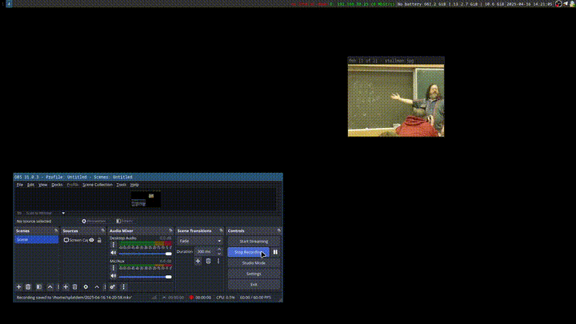
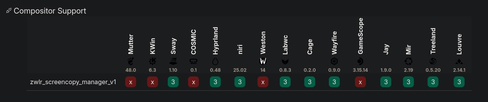

# Soomer
Soomer is a zoomer application for wayland written in rust.



## Bindings
| Key     | Action          |
|---------|-----------------|
| `ESC/Q` | Quit            |
|   `S`   | Save screenshot |
|   `E`   | Save region     |
|   `C`   | Reset scale     |
|   `R`   | Reset all       |

## Configuration
Default config:
```json
{
    "bg": {
        "r": 10,
        "g": 0,
        "b": 15,
        "a": 255
    },
    "scale": {
        "max": 10.0,
        "min": 1.0,
        "factor": 1.1
    },
    "update_delay": 60,
    "smooth_factor": 0.15,
    "monitor": 0,
    "screenshot_save_path": "./",
    "screenshot_save_name": "screenshot.png" // This will transform into something like
                                             // ./smr_174542535.13243545_screenshot.png
}
```

## Building
```
cargo build --release
sudo cp target/release/soomer /bin
```

This program uses ZwlrScreencopy Manager, so it will not work in some DEs or compositors

Image from https://wayland.app/protocols/wlr-screencopy-unstable-v1
